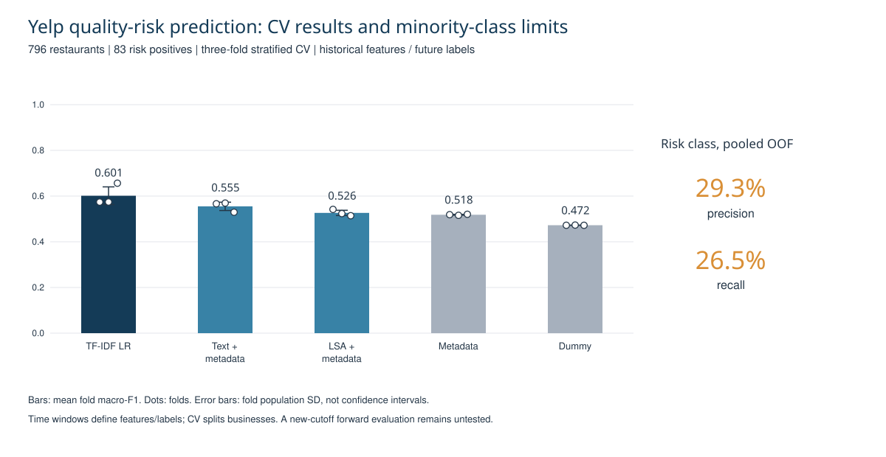

# Yelp NLP & Restaurant Quality-Risk Prediction

An independently completed UIUC data-mining capstone covering review topic analysis, cuisine-level representations, dish-evidence extraction, temporal diagnostics, and restaurant quality-risk prediction.

I implemented all six tasks. The predictive endpoint uses historical review features and future rating labels, with preprocessing fitted inside each training fold.



## Pipeline and contributions

```text
Review/business data → Historical feature window + future label window
                    → Fold-specific TF-IDF preprocessing
                    → Class-balanced logistic regression
                    → Stratified CV + out-of-fold error analysis

Review text → Topic/cuisine analysis → Controlled dish vocabulary
                                  → Dish evidence and temporal diagnostics
```

| Task | Implementation and scale |
|---|---|
| 1. Topic analysis | 43,371 Mexican reviews / 1,749 businesses; N-grams and LDA; BERTopic on a 3,000-review sample |
| 2. Cuisine representations | 80,000 reviews / 6,384 businesses; 25 category-level vectors; TF-IDF and Sentence Transformers; UMAP visualization; HDBSCAN on category embeddings |
| 3. Dish vocabulary | 14,475 Chinese-restaurant reviews / 80 businesses; 35 approved dish terms |
| 4. Dish evidence/ranking | 10,583 dish-level evidence instances; rating-, lexicon-, and RoBERTa-based comparisons |
| 5. Temporal analysis | 4,898 reviews; 80 restaurants; 12 dishes; 31 supported quarters; normalized mention rates and exploratory diagnostics |
| 6. Quality-risk prediction | 796 restaurants; 83 risk positives; temporally separated features/labels; three-fold stratified CV |

## Predictive results

| Model | Mean fold macro-F1 |
|---|---:|
| TF-IDF + logistic regression | 0.601 |
| TF-IDF + metadata LR | 0.555 |
| LSA + metadata LR | 0.526 |
| Metadata LR | 0.518 |
| Dummy majority baseline | 0.472 |

TF-IDF LR exceeded the dummy by 12.9 percentage points. Its three fold scores were 0.574, 0.574, and 0.656; population SD across folds was 0.039.

The out-of-fold risk-class precision was 29.3% and recall 26.5% (22 TP, 61 FN, 53 FP, 660 TN). These minority-class results limit operational usefulness despite the aggregate macro-F1.

## Evaluation contract

The time cutoff is July 1, 2013. Features use earlier reviews; future average ratings define the label. Eligible businesses have at least six historical and five future reviews. Risk requires a rating drop of at least 0.75 and future average rating at most 3.5.

Model evaluation is `StratifiedKFold(3, shuffle=True, random_state=42)`, not chronological model train/test splits. The main TF-IDF model's preprocessing is fitted inside each training fold. The result does not establish performance at a new time cutoff or production deployment.

## Evidence

- [Full model-comparison table and fold scores](results/model_comparison.csv).
- [Out-of-fold confusion matrix](results/oof_confusion_matrix.csv) and [classification report](results/oof_classification_report.csv).
- [Reproduction notes and task-version boundaries](docs/REPRODUCIBILITY.md).
- [Audited source hashes](results/source_manifest.json).

## Limitations and next experiments

Dish-level evidence instances are not independent review documents. Topic and temporal findings are exploratory. The optional TF-IDF/SVD fallback in Task6 needs fold-specific fitting before using that branch for a valid CV comparison; it does not invalidate the primary TF-IDF Pipeline result.

A forward evaluation at a new time cutoff, with frozen model/threshold and risk precision-recall analysis, would provide stronger evidence for future-risk use.

## Data availability

This repository contains the six source notebooks and aggregate results, without raw review text, user/business identifiers, or downloaded model weights. Obtain datasets through their original distribution and document the preprocessing needed to rebuild the eligible cohort.

## Source notebooks

- [Task 1: source notebook](notebooks/task1_student_v20.ipynb)
- [Task 2: source notebook](notebooks/task2_student_v20.ipynb)
- [Task 3: source notebook](notebooks/task3_student_v21.ipynb)
- [Task 4: source notebook](notebooks/task4_student_v21.ipynb)
- [Task 5: source notebook](notebooks/task5_student_v21.ipynb)
- [Task 6: source notebook](notebooks/task6_student_v21.ipynb)

Notebook outputs and machine metadata were removed; implementation cell sources are unchanged. These are the saved completed notebooks, not a newly executed end-to-end run.

## Quick result check

Python 3, standard library only:

```sh
python scripts/verify_results.py
```

This verifies exported tables, not model training or raw-output correctness.
